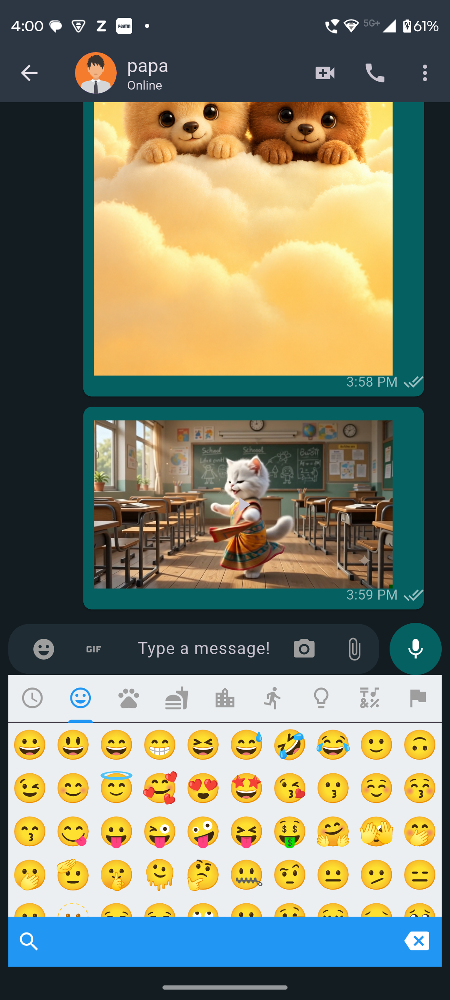
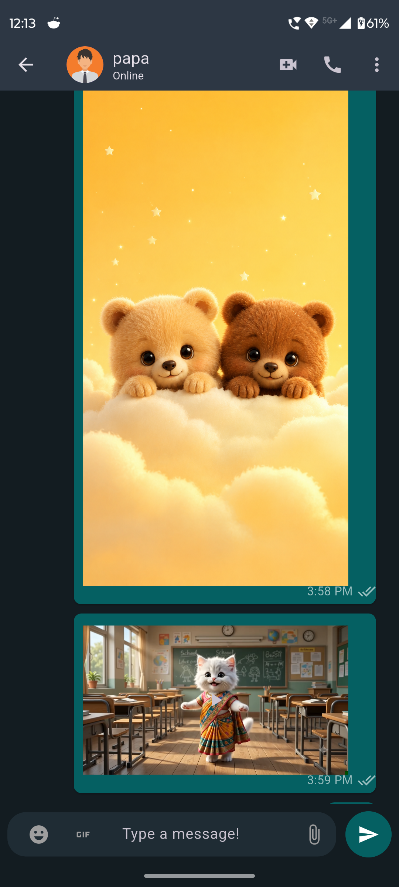
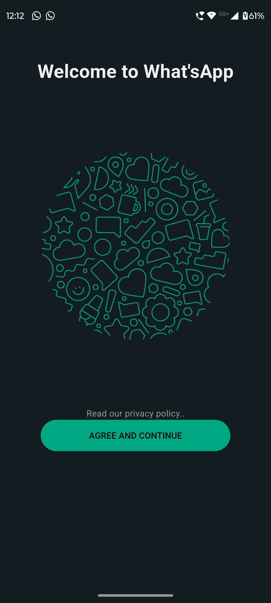
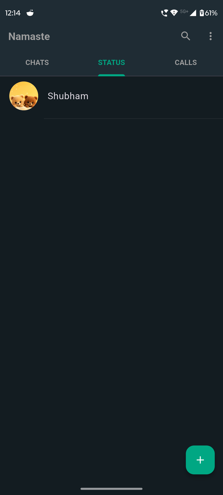
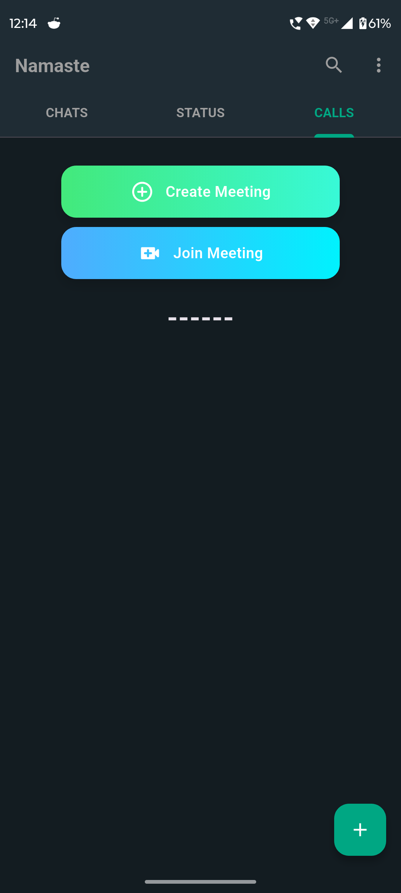
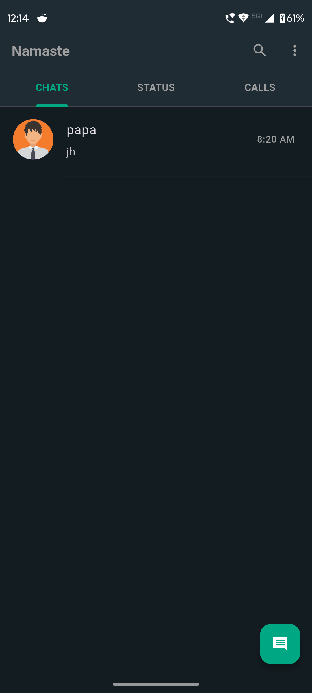

## Download APK

Namaste ChatApp
A Flutter-based real-time messaging application inspired by WhatsApp, featuring chat, voice/video calling, media sharing, and Firebase integration.

Features:-
User Authentication Using Mobile Number
Real-time Messaging
Image Sharing
Video Calls
Online/Offline Status
Status for 24 hours

Tech Stack
Flutter
Dart

Backend & Services
Firebase Authentication
Cloud Firestore
Firebase Storage

Calling & Meetings
Jitsi Meet SDK

State Management 
Riverpod

Folder Structure
C:\ANDROID PROJECTS\WHATAPP_CLONE\LIB
│   colors.dart
│   contact_list.dart
│   firebase_options.dart
│   info.dart
│   main.dart
│   router.dart
│
├───common
│   ├───enums
│   │       message_enum.dart
│   │
│   ├───providers
│   │       message_reply_provider.dart
│   │
│   ├───repository
│   │       common_firebase_storage_repository.dart
│   │
│   ├───utils
│   │       utils.dart
│   │
│   └───widgets
│           chat_list.dart
│           custom_button.dart
│           error.dart
│           loader.dart
│           my_message_card.dart
│           sender_message_card.dart
│           snackbar.dart
│
├───features
│   ├───chat
│   │   ├───controller
│   │   │       chat_controller.dart
│   │   │
│   │   ├───repository
│   │   │       chat_repository.dart
│   │   │
│   │   ├───screens
│   │   │       mobile_chat_screen.dart
│   │   │
│   │   └───widgets
│   │           bottom_chat_field.dart
│   │           display_msg_image_gif.dart
│   │           message_reply_preview.dart
│   │           vide_player_item.dart
│   │
│   ├───landing
│   │   └───screens
│   │       │   landingpage.dart
│   │       │
│   │       └───auth
│   │           ├───controller
│   │           │       auth_controller.dart
│   │           │
│   │           ├───repositories
│   │           │       auth_repository.dart
│   │           │
│   │           └───screens
│   │                   login_screen.dart
│   │                   mobile_layout_screen.dart
│   │                   otp_screen.dart
│   │                   select_contacts_screen.dart
│   │                   user_info_screen.dart
│   │
│   ├───meeting
│   │   ├───controller
│   │   │       jistmeet_controller.dart
│   │   │
│   │   ├───repository
│   │   │       jistimeet_repository.dart
│   │   │
│   │   ├───screens
│   │   │       meeting_screen.dart
│   │   │
│   │   ├───state
│   │   │       jitsimeet_state.dart
│   │   │
│   │   └───widget
│   │           meeting_btns.dart
│   │
│   ├───select_contacts
│   │   ├───controller
│   │   │       select_contact_controller.dart
│   │   │
│   │   └───repository
│   │           select_contact_repository.dart
│   │
│   └───status
│       ├───controller
│       │       status_controller.dart
│       │
│       ├───respository
│       │       status_repository.dart
│       │
│       └───screens
│               confirm_status.dart
│               show_status_screen.dart
│               status_screen.dart
│               status_screen_latest.dart
│
├───models
│       chat_contact.dart
│       message.dart
│       status_model.dart
│       user_model.dart

## Screenshots

  
  
  
  
  
  
  

